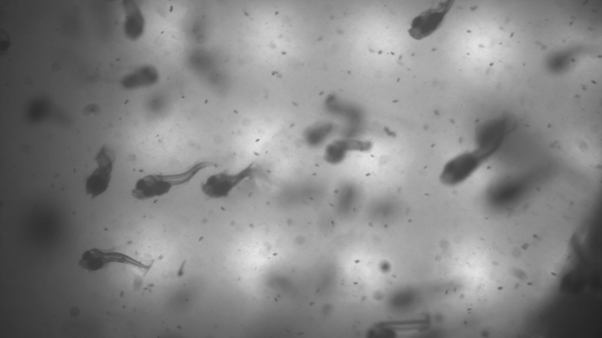
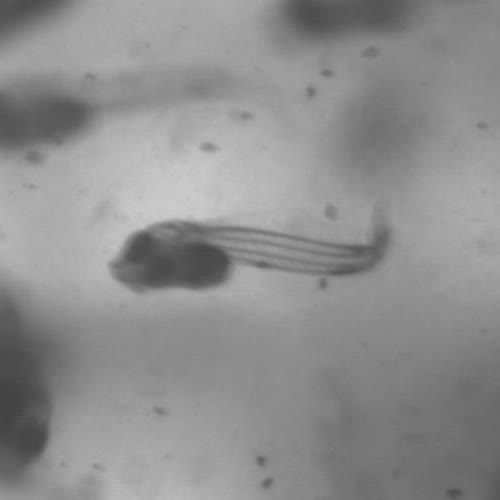

# fish_larvae_feeding
An evidence-based agriculture project using computer vision and deep learning to detect feeding behavior in videos
 of fish larvae grown in aquaculture (fish farms). 

 
 * [Motivation](#Motivation)
 * [Problem Description](#the-problem)
 * [Phase A - Data Collection](#phase-a---data-collection)
    * [MovieCutterGUI.py](#moviecutterguipy)
        * [MovieCutter.py](#moviecutterpy)
    * [LabelerGUI.py](#lablerguipy)
 * [Usage](#Usage)
    * [Dependencies](#Dependencies)
 * [Next Steps](#Next-Steps)
 

 
 ## Motivation
Fish is an important protein source. According to the FAO, fish provided more than 3.3 billion people with 20 percent
of their average intake of animal proteins.  
Since the 1960's fish consumption has been increasing globally by approximately 1.5% each year. 
However, due to overfishing of wild fish stocks, the fisheries sector (i.e catching fish out in the wild)
has not been able to sustainably keep up with the demand.  
While the contribution of fisheries to the global fish production has plateaued, aquaculture's contribution sky-rocketed. 
From only 9% of the global fish produce in the 1980's, to 52% of the fish in 2018. 
As struggles for sustainable fishing continues and the demand for fish protein increases, 
this figure is projected to go even higher.  
The problem is, growing fish is not very efficient. The first period in the fish larvae's life is characterized by
high mortality rates - 90%-99% of larvae in the wild die. In aquaculture, in closely monitored environment, 
this mortality rate is roughly 70%. The expense of maintaining this environment, alongside the high mortality rate,
makes this stage in the larvae's life the most costly in the fish production pipeline.  
This means even incremental improvements may reduce cost and waste to farmers and increase production and profits. 
Previous research has implicated the larvae's feeding mechanism as one of the main factors for this phenomena. 
So, to better understand the mortality rates, and the effects of different environmental variable on the fish, 
a system for monitoring larvae feeding behavior is necessary.

## The Problem
The object is to monitor fish larvae feeding behavior within commercial aquaculture pools. 
To do this, a high-speed camera has been placed inside such pools and videos of varying lengths are captured.  
Fish, unlike terrestrial creatures, live in a 3-Dimensional volume, rather then on a 2-Dimensional surface. 
This means movement can be in any and every direction and instances were fish obscure each other are frequent. 
Unlike a laboratory setting where one can control the amount of individuals in a frame of video, 
here we may have tens of fish in a single frame.  
In addition, feeding events are sparse - most of the videos will be filled with fish swimming, occasionally 
one would eat, or try to. This combination of factors, make it hard for both a machine and a 
human observer to analyse the videos and extract different behaviors from them.  
For this reason, we decided to, first, create a dataset of labeled short video segments, 
each centered around one individual fish (ideally). 
In a nutshell, we want to go from this:  

 
To this:  

 
(only in video)
 
This will be phase A of the project. Phase B, once this dataset is ready, will be to use deep learning, and more specifically, weakly supervised learning, to build a tool for automated detection of feeding behavior. 

## Phase A - Data Collection
I've developed a set of tools to help create a database with tagged samples of fish larvae activity.
These tools use simple image processing to detect fish in a video and create smaller video segments with individual fish.

### MovieCutterGUI.py
A Graphic User Interface (GUI) developed with Python's tkinter. It enables users to choose video files, saving directory, and
cut the file using the MovieCutter class (details below), while monitoring the progress of the cutting process.
This demo explains it best:  
 
 

 
 

#### MovieCutter.py
A script to process full length videos and cut them into short video segments of (ideally) a single fish.
Outputs a folder of video segments and a corresponding log file.
The processing is done for the most part by using basic image processing with the OpenCV package.
 
### LabelerGUI.py
Another tkinter GUI, used to label the video segments created by the MovieCutter.   
The user selects a directory of video segments; These are then loaded into the GUI; 
The user can then play them, navigate between videos and apply labels according to the behavior of the fish in the 
frame: There is a myriad of feeding behaviors and an option to mark videos for deletion.  
The GUI will save the video labels to the log file and delete unnecessary video files. 
Please check out this demo for a detailed walk-through: 
 
 

 
 

## Usage
Clone this repository or download the scripts, please make sure you have all the dependencies before trying to run this.
### Dependencies:
The code was developed in python 3.8 and assumes the existence of the following libraries:
* OpenCV 
* tkinter
* PIL
* Pandas
* Numpy
* imutils

Using Terminal (Mac) or commandline (Windows), set the folder with the scripts as the current working 
directory and use:  
`$ python MovieCutterGUI.py`  
To activate the Movie Cutter application. And:  
`$ python LabelerGUI.py`  
To activate the Labeling application. 

## Next steps
After creating a database, training a CNN image classifier to detect the fish activity.

